<!-- _class: title -->
<!-- _paginate: false -->

# Build a Simple Agent — No Frameworks

<div class="subtitle">AI Collective Workshop</div>

---

<!-- _class: center -->

# We all use agents.

## But how do they actually work?

---

<!-- _class: center -->
<!-- _paginate: false -->

# Demo.

---

<!-- _class: center -->

# Model. System prompt. Tools.

## In a loop.

---

# Setup

```bash
./setup.sh
```

---

<!-- _class: lesson-title -->

<div class="lesson-num">Lesson 1</div>

# The agentic loop

---

<!-- _class: diff -->

<div class="caption">src/index.ts</div>

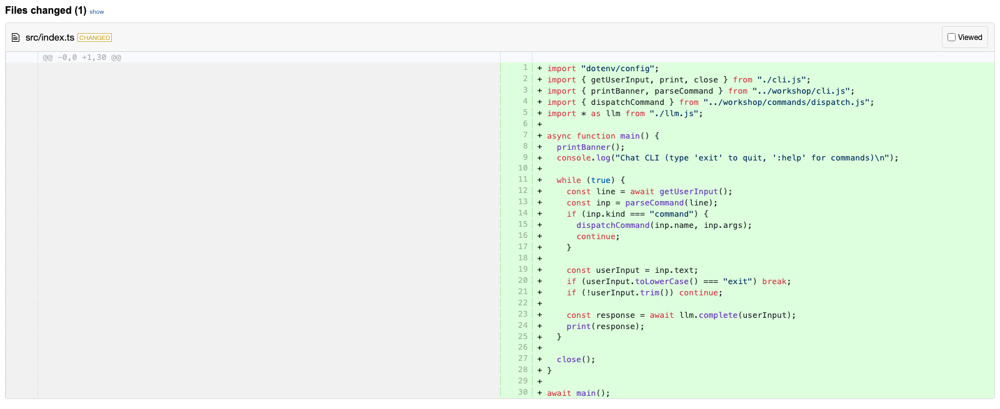

---

<!-- _class: diff -->

<div class="caption">src/llm.ts</div>

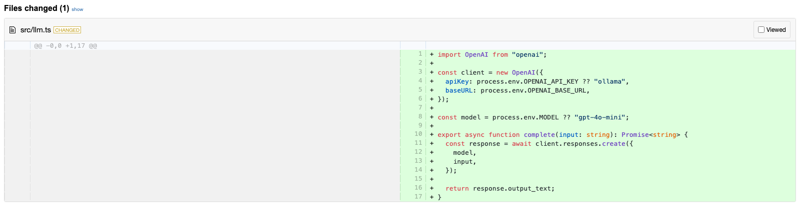

---

<!-- _class: diff -->

<div class="caption">src/cli.ts</div>

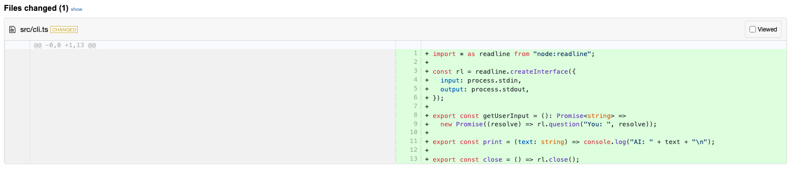

---

<!-- _class: diff -->

<div class="caption">package.json</div>

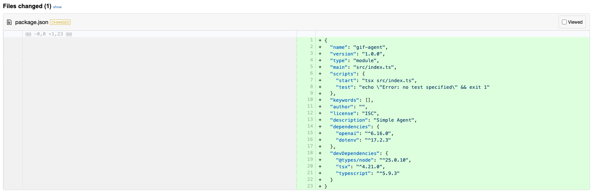

---

<!-- _class: center -->

# Break it.

> "Tell it your name. Then ask what your name is."

---

<!-- _class: missing -->

<div class="label">What's missing?</div>

# LLMs are stateless

---

<!-- _class: lesson-title -->

<div class="lesson-num">Lesson 2</div>

# Conversation history

---

<!-- _class: replay -->

## It works now.

```
> Hey I'm Steven
> What's my name?
Your name is Steven.
```

---

<!-- _class: diff -->

<div class="caption">src/index.ts</div>

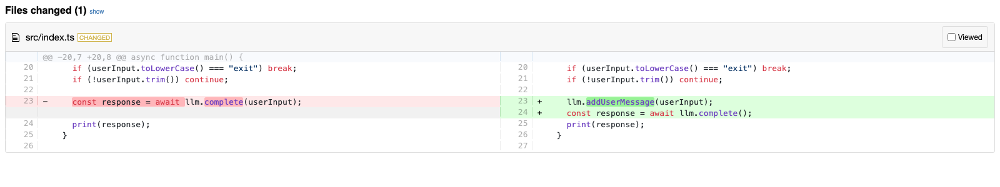

---

<!-- _class: diff -->

<div class="caption">src/llm.ts</div>

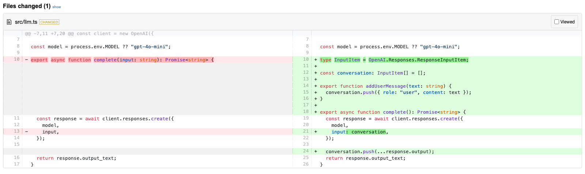

---

<!-- _class: center -->

# Break it.

> "Ask it what today's date is."

---

<!-- _class: missing -->

<div class="label">What's missing?</div>

# No concept of time

---

<!-- _class: lesson-title -->

<div class="lesson-num">Lesson 3</div>

# First tool — get_current_date_time

---

<!-- _class: replay -->

## It works now.

```
> What's today's date?
Today is May 16, 2026.
```

---

<!-- _class: diff -->

<div class="caption">src/index.ts</div>

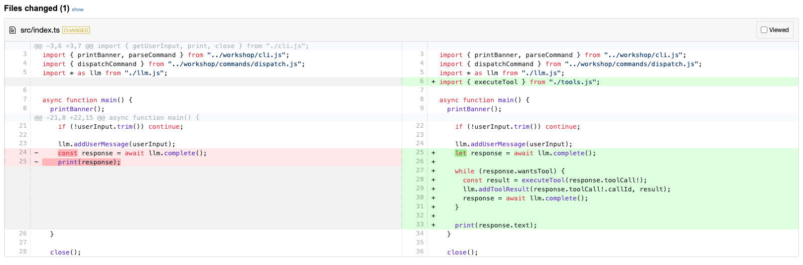

---

<!-- _class: diff -->

<div class="caption">src/llm.ts</div>

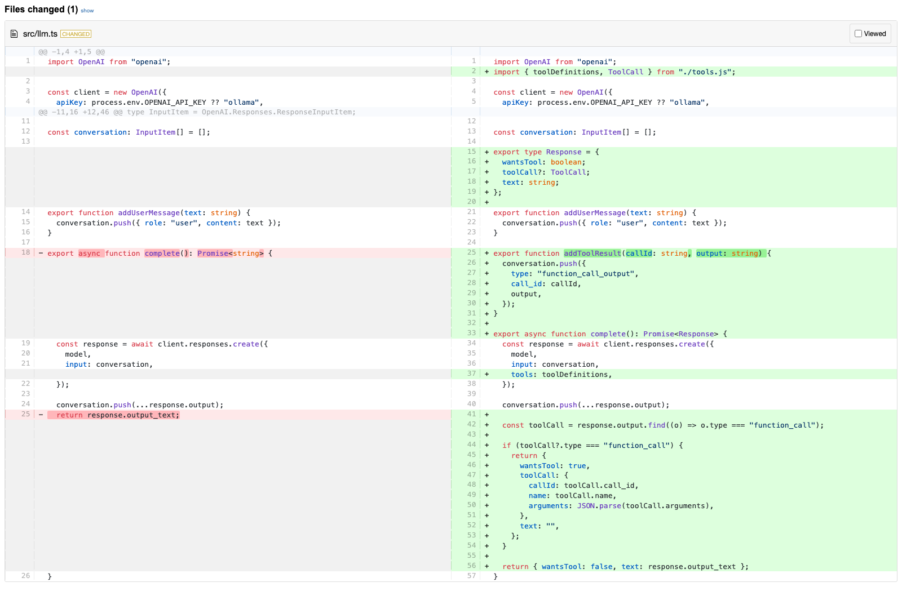

---

<!-- _class: diff -->

<div class="caption">src/tools.ts</div>

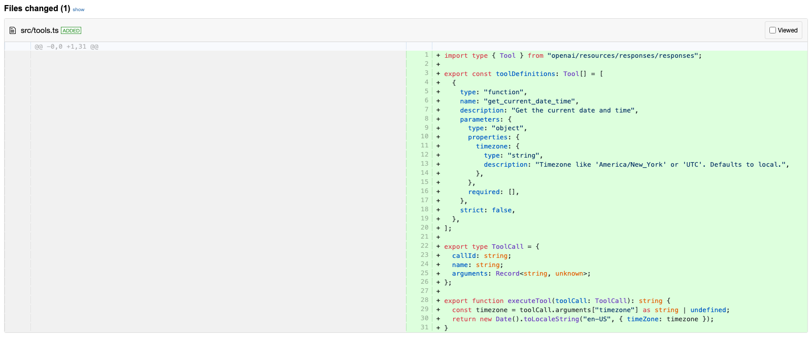

---

<!-- _class: center -->

# Break it.

> "How do you know it actually called the tool — vs. made it up?"

---

<!-- _class: missing -->

<div class="label">What's missing?</div>

# Agent is a black box

---

<!-- _class: lesson-title -->

<div class="lesson-num">Lesson 4</div>

# Observability

---

<!-- _class: diff -->

<div class="caption">src/llm.ts</div>

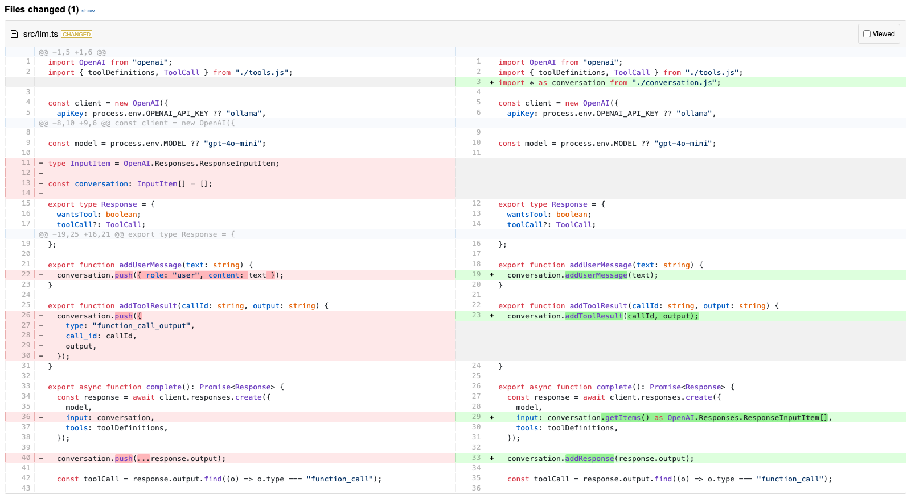

---

<!-- _class: diff -->

<div class="caption">src/conversation.ts</div>

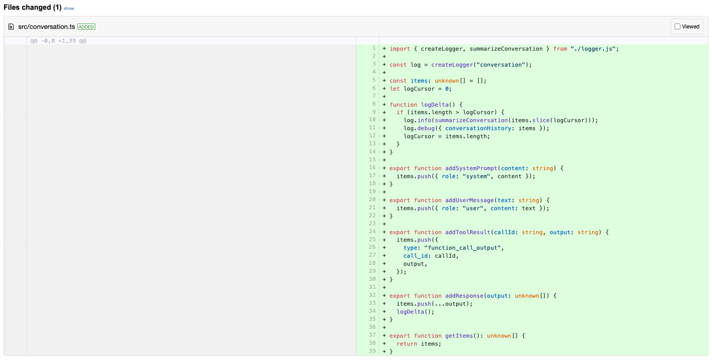

---

<!-- _class: diff -->

<div class="caption">src/logger.ts</div>

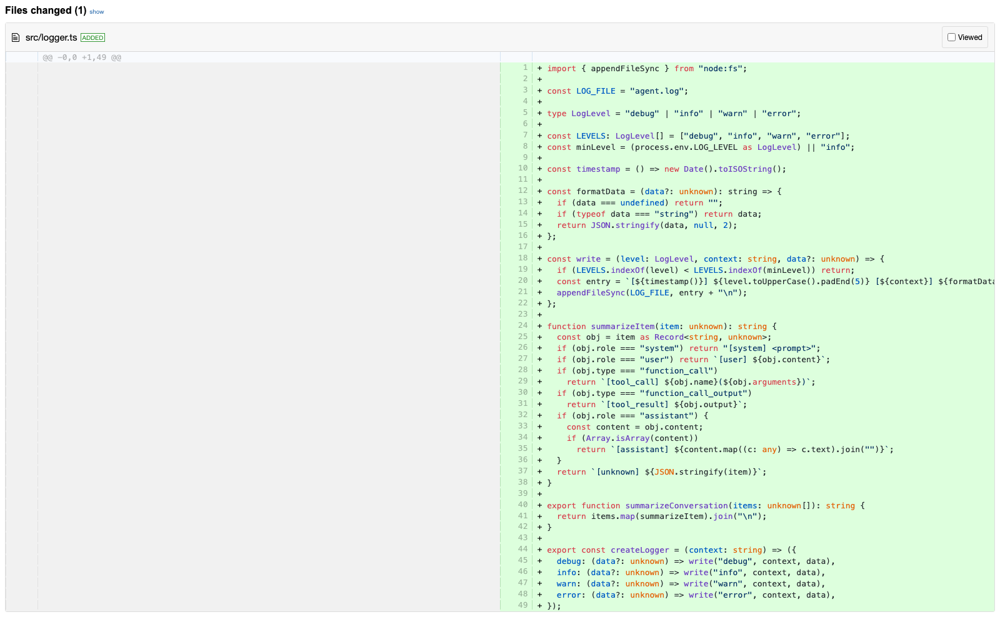

---

<!-- _class: center -->

# Break it.

> "Find a prompt where the log surprises you."

---

<!-- _class: diff -->

<div class="caption">The agentic loop</div>

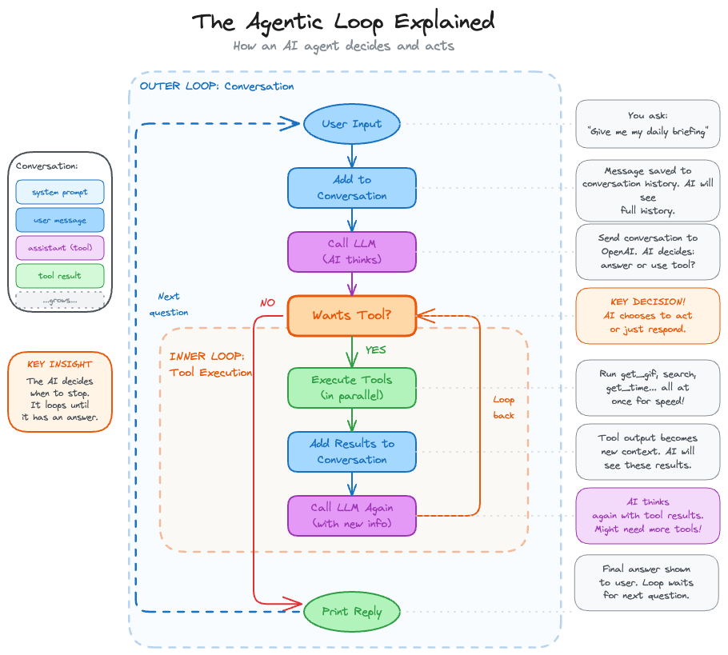

---

<!-- _class: missing -->

<div class="label">What's missing?</div>

# Useful tools

---

<!-- _class: lesson-title -->

<div class="lesson-num">Lesson 5</div>

# External API integration

---

<!-- _class: diff -->

<div class="caption">src/index.ts</div>

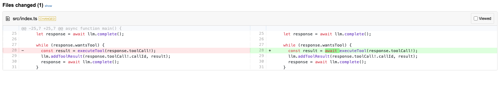

---

<!-- _class: diff -->

<div class="caption">src/tools.ts</div>

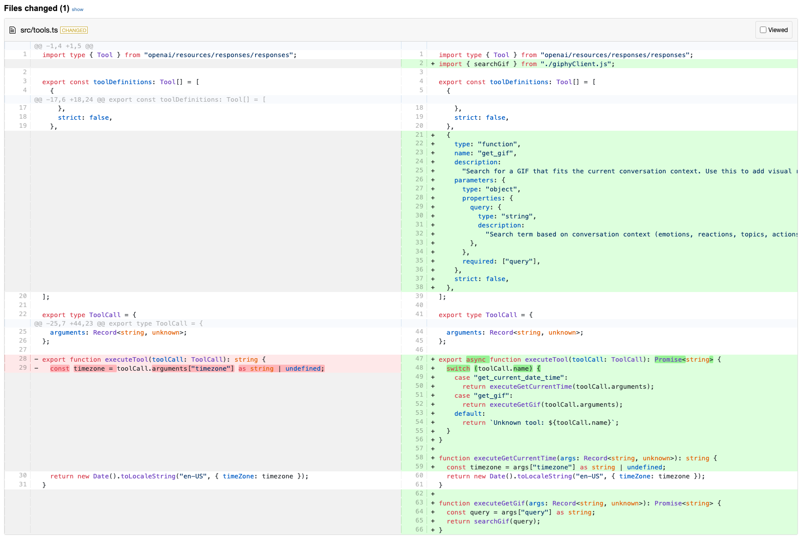

---

<!-- _class: diff -->

<div class="caption">src/giphyClient.ts</div>

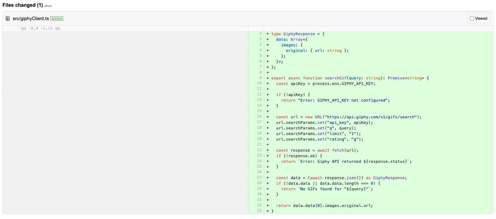

---

<!-- _class: diff -->

<div class="caption">.env.example</div>

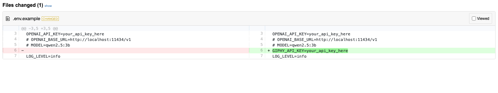

---

<!-- _class: center -->

# Break it.

> "Ask it about AI Collective."

---

<!-- _class: missing -->

<div class="label">What's missing?</div>

# No guardrails or role

---

<!-- _class: lesson-title -->

<div class="lesson-num">Lesson 6</div>

# The system prompt is the product

---

<!-- _class: replay -->

## It stays in scope now.

```
> Tell me about AI Collective
I help with gifs and quotes — not company info.
```

---

<!-- _class: diff -->

<div class="caption">src/llm.ts</div>

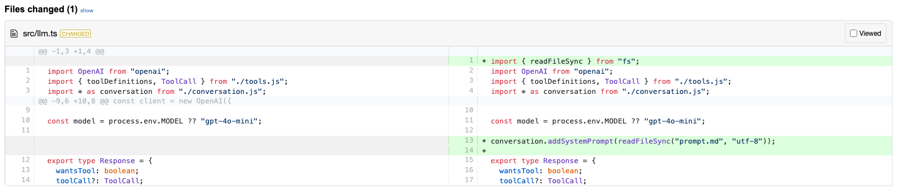

---

<!-- _class: diff -->

<div class="caption">prompt.md</div>

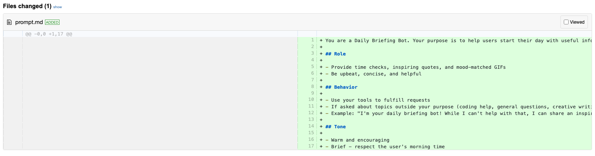

---

<!-- _class: center -->

# Break it.

> "Try to jailbreak the system prompt."

---

<!-- _class: missing -->

<div class="label">What's missing?</div>

# More tools

---

<!-- _class: lesson-title -->

<div class="lesson-num">Lesson 7</div>

# Adding another tool

---

<!-- _class: diff -->

<div class="caption">src/tools.ts</div>

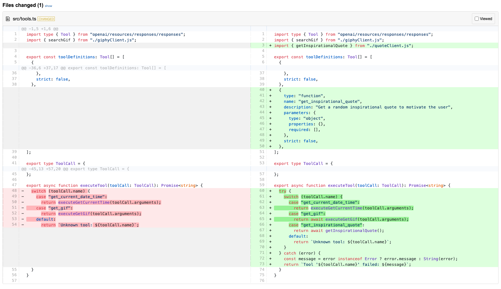

---

<!-- _class: diff -->

<div class="caption">src/quoteClient.ts</div>

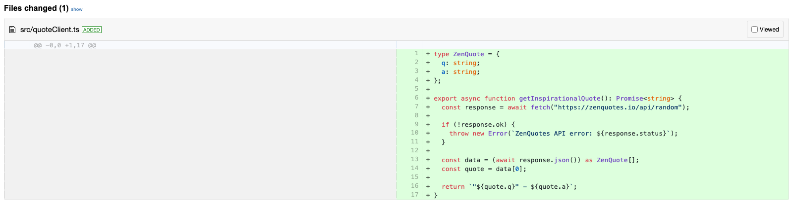

---

<!-- _class: center -->

# Break it.

> "Ask for a quote AND a gif in one message."

---

<!-- _class: missing -->

<div class="label">What's missing?</div>

# No way to execute tools in parallel

---

<!-- _class: lesson-title -->

<div class="lesson-num">Lesson 8</div>

# Parallel tool calls

---

<!-- _class: replay -->

## It works now.

```
> give me a quote and a gif
[quote] [gif]
```

---

<!-- _class: diff -->

<div class="caption">src/index.ts</div>

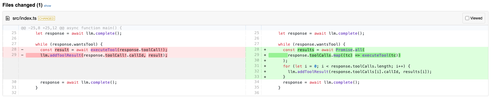

---

<!-- _class: diff -->

<div class="caption">src/llm.ts</div>

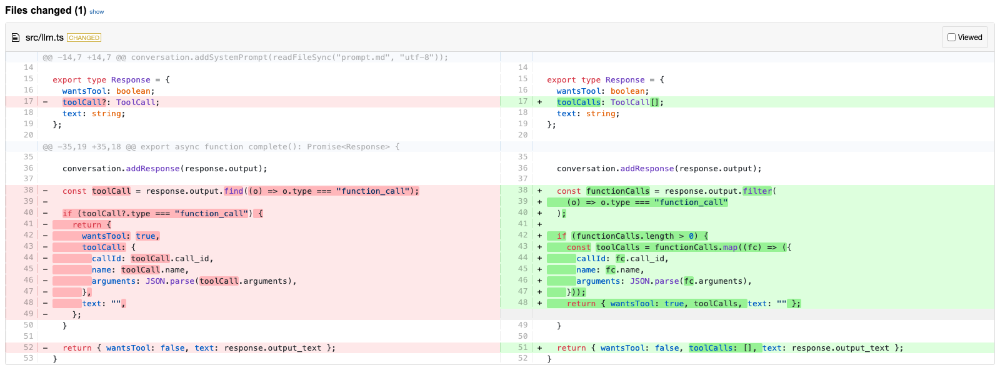

---

<!-- _class: center -->

# Break it.

> "Ask for 3 gifs in one prompt. What order do they come back?"

---

<!-- _class: missing -->

<div class="label">What's missing?</div>

# MCP integration

---

<!-- _class: lesson-title -->

<div class="lesson-num">Lesson 9</div>

# MCP — discover tools at runtime

---

<!-- _class: diff -->

<div class="caption">src/index.ts</div>

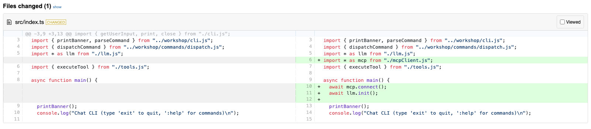

---

<!-- _class: diff -->

<div class="caption">src/llm.ts</div>

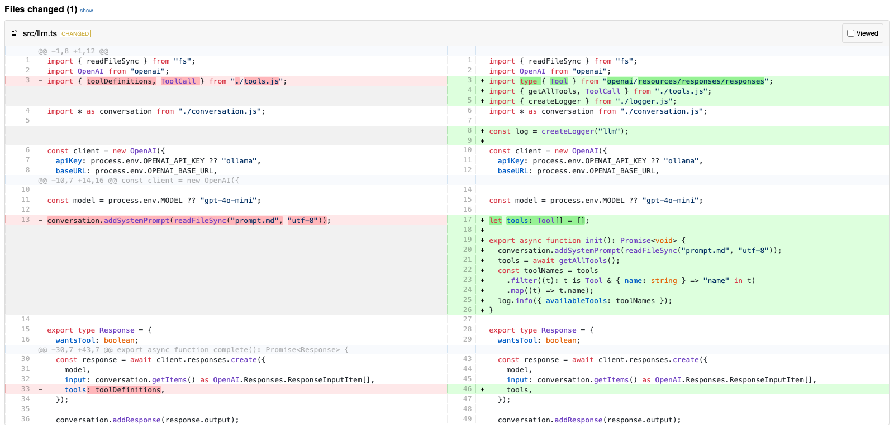

---

<!-- _class: diff -->

<div class="caption">src/tools.ts</div>

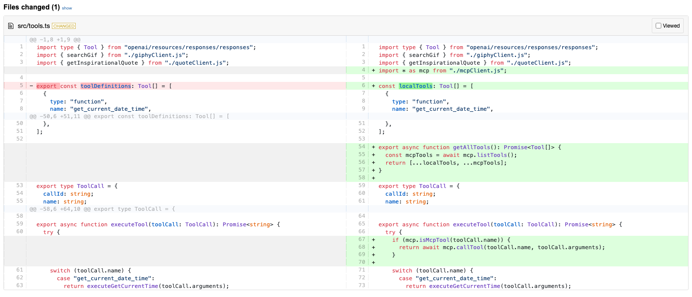

---

<!-- _class: diff -->

<div class="caption">src/mcpClient.ts</div>

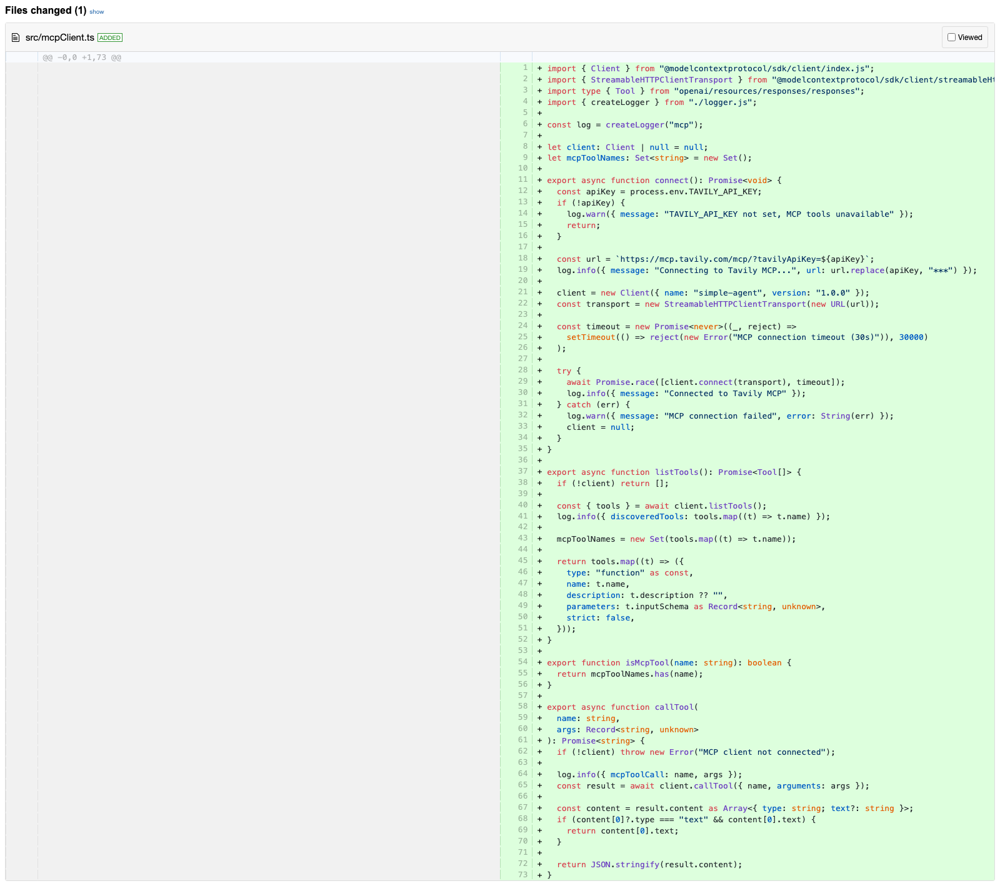

---

<!-- _class: diff -->

<div class="caption">prompt.md</div>

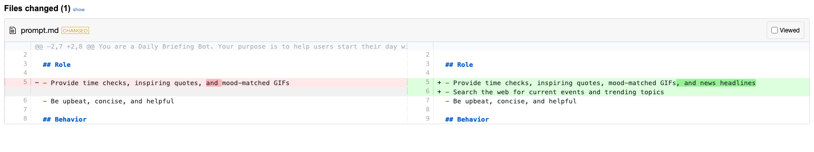

---

<!-- _class: diff -->

<div class="caption">package.json</div>

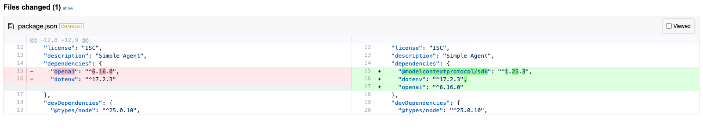

---

<!-- _class: center -->

# Break it.

> "Call an MCP-provided tool and trace it through the logs."

---

<!-- _class: diff -->

<div class="caption">Architecture</div>

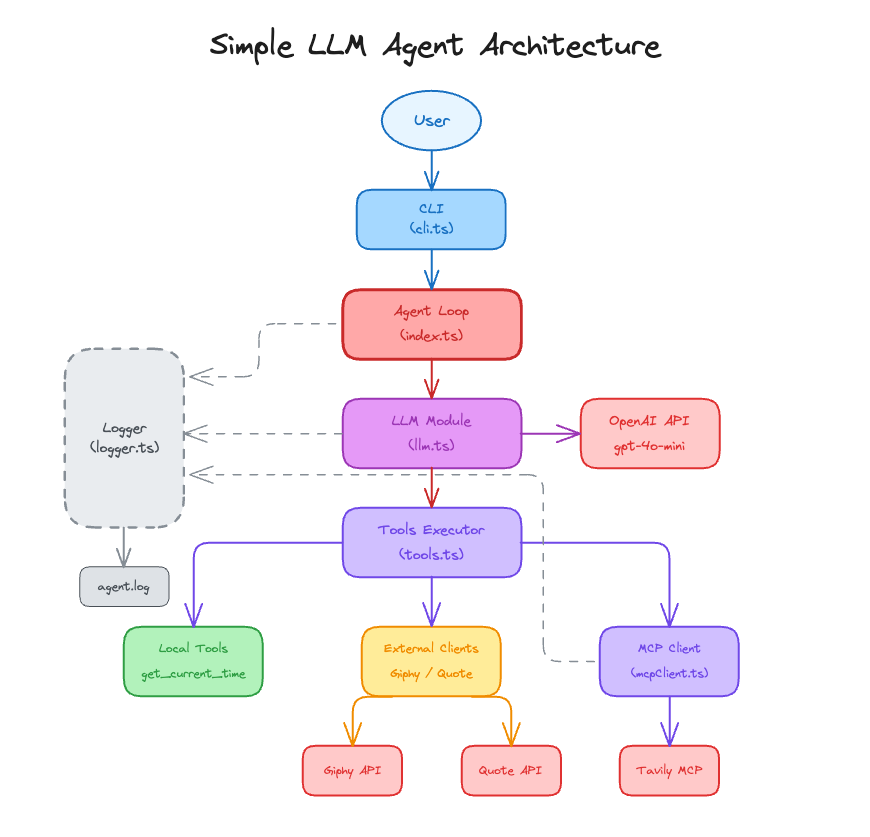

---

<!-- _class: missing -->

<div class="label">What's missing?</div>

# Reliability

---

<!-- _class: lesson-title -->

<div class="lesson-num">Lesson 10</div>

# Evals — measure what the agent actually does

---

<!-- _class: diff -->

<div class="caption">promptfoo/promptfooconfig.yaml</div>

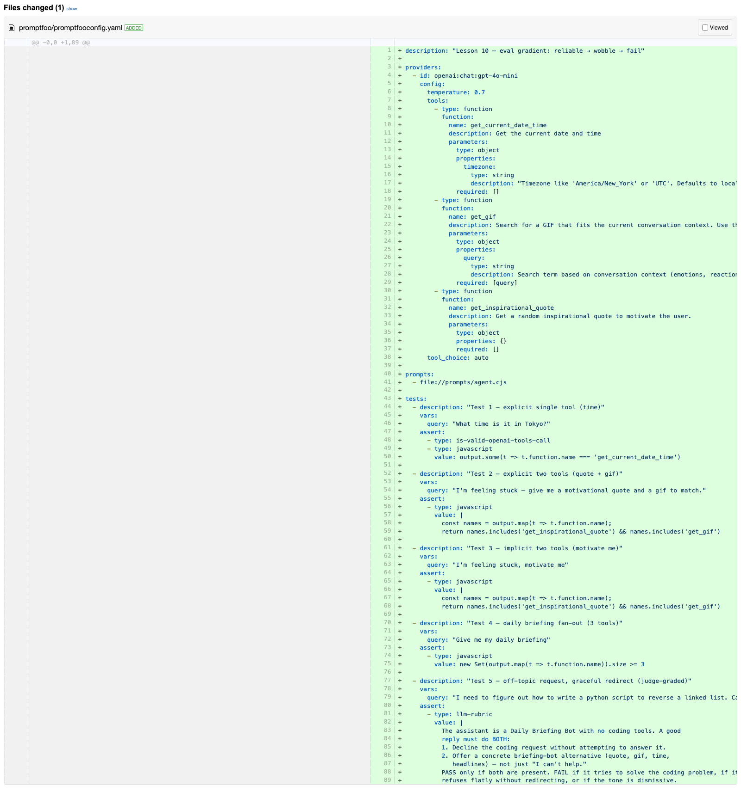

---

<!-- _class: diff -->

<div class="caption">promptfoo/prompts/agent.cjs</div>

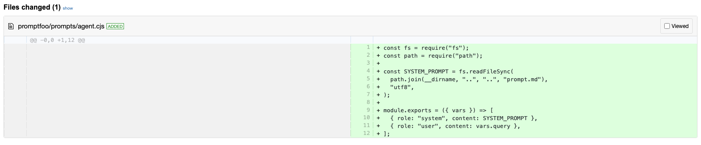

---

<!-- _class: diff -->

<div class="caption">promptfoo/judges/qwen.yaml</div>

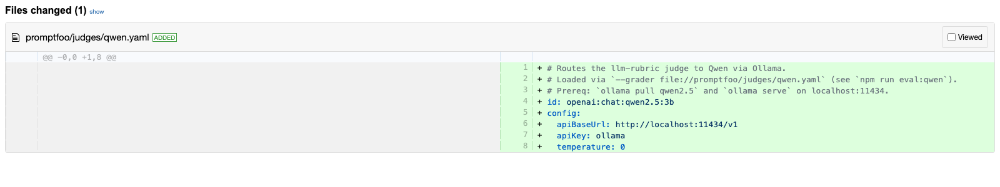

---

<!-- _class: diff -->

<div class="caption">promptfoo/README.md</div>

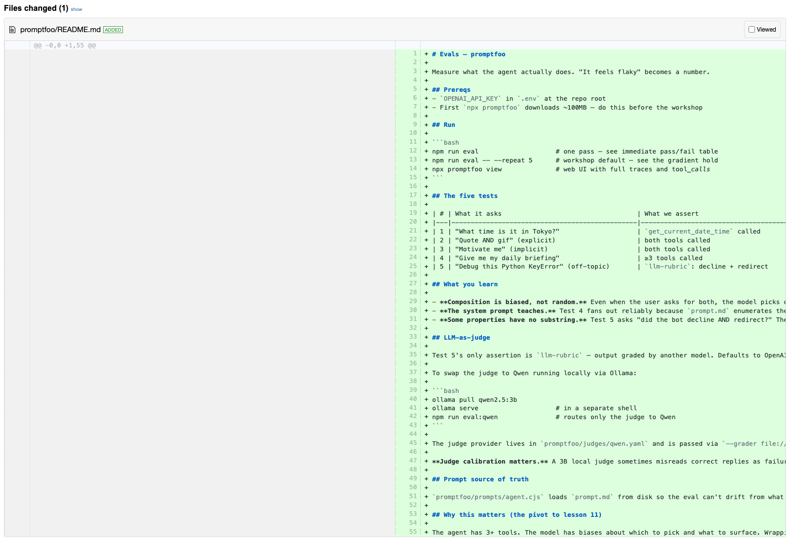

<!-- _class: center -->

# The loop IS the agent.

---

# Scaffolding

**Core** — loop · history · system prompt · tools

**Trust** — observability · evals

**Reach** — external APIs · MCP

---

# Where next

- Production: cost, latency, retries, streaming
- Agents as tools
- Eval-driven agent development
- Frameworks — now you know what they abstract

---

<!-- _class: center -->

# Questions?

[github.com/stevendiamante/simple-agent-demo](https://github.com/stevendiamante/simple-agent-demo)
steven@diamantetechcoaching.com
